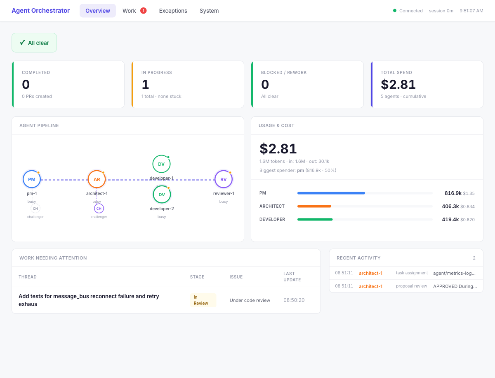
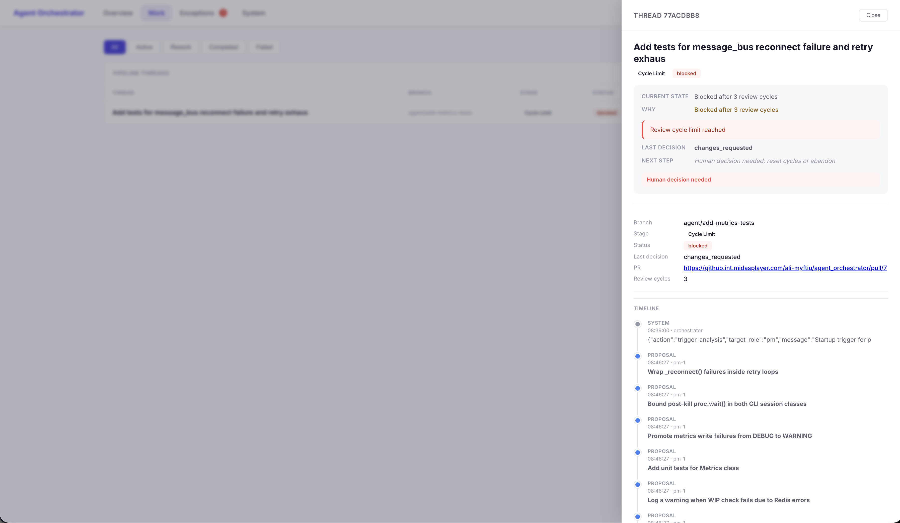
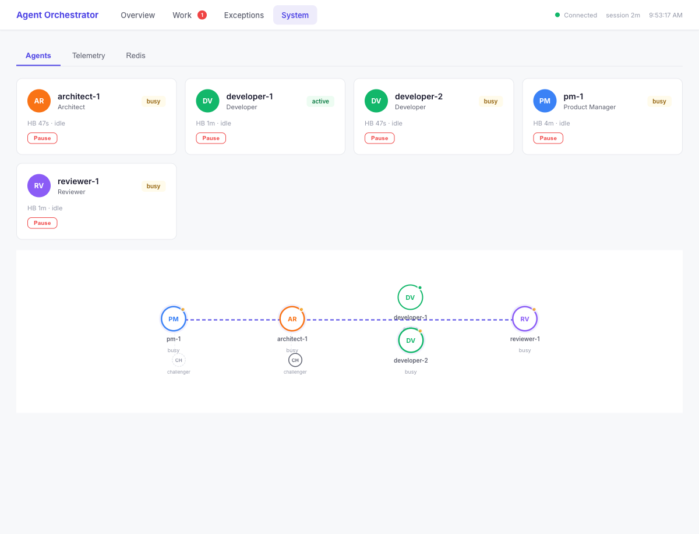

# Agent Orchestrator

A multi-agent collaboration system that autonomously analyzes, improves, and reviews any codebase. Each agent is a long-running Claude Code or Codex CLI session, coordinated via Redis streams.

**Requirements:** Python >= 3.11, Redis, Claude Code CLI and/or Codex CLI.

## Web Dashboard

The orchestrator includes a browser-based dashboard (`agent-orchestrator web`) for monitoring pipeline activity, cost, and agent health.

### Overview — Outcomes, cost, and what needs attention



### Work — Every thread in the pipeline with status and decisions



### System — Agent cards with pause/resume, pipeline with challengers



## Architecture

```
                     Orchestrator (Python)
                     |- Bridges Redis <-> CLI stdin/stdout
                     |- Monitors health, restarts crashed agents
                     |- Enforces concurrency + safety + WIP limits
                     |- Routes human approval gates
                              |
         +-------------------+-------------------+
         |                   |                   |
    PM Agent            Architect           Developer(s)         Reviewer
  (claude, opus)     (claude, opus)     (claude, opus)          (codex)
  plan mode          plan mode          acceptEdits mode        read-only
         |                   |                   |                   |
         +--------- Redis Streams (persistent, blocking reads) -----+
```

**Workflow:**
1. PM analyzes the codebase and proposes improvements (guided by `PRODUCT_FOCUS.md`)
2. Architect reviews proposals, approves/rejects, writes tech specs
3. Developer(s) implement approved specs on `agent/*` branches
4. Reviewer reviews diffs, approves or requests changes
5. Approved changes get PRs created via `gh`

## Quick Start

### 1. Install prerequisites

```bash
# Claude Code CLI
npm install -g @anthropic-ai/claude-code
claude login

# Codex CLI (if using Codex agents)
npm install -g @openai/codex
codex auth

# GitHub CLI (for PR creation, optional)
gh auth login
```

### 2. Start Redis

The orchestrator needs a Redis instance. Any Redis >= 5.0 works — local install, Docker, managed service, etc.

The repo includes a `docker-compose.yaml` as a convenience:

```bash
docker compose up -d
```

Or point at an existing Redis:

```bash
export AGENT_ORCH_REDIS_URL=redis://your-redis-host:6379/0
```

### 3. Install and run

```bash
bash agents/setup_venv.sh
source agents/.venv/bin/activate

agent-orchestrator preflight                    # Validate everything
agent-orchestrator run                          # Start the orchestrator
```

### 4. Operator tools (separate terminals)

```bash
source agents/.venv/bin/activate
agent-orchestrator web                          # Web dashboard (browser)
agent-orchestrator monitor                      # Real-time TUI dashboard
agent-orchestrator approve                      # Handle approval gates
```

## Deployment Model

The orchestrator runs as a **host process**, not a container. This is intentional:

- Claude Code and Codex CLIs authenticate via `claude login` / `codex auth` on the host
- Agents spawn CLI subprocesses that read/write the target codebase, run git, and execute tests
- These require native filesystem and tool access — containerizing adds friction without benefit

**Redis** can run anywhere — the repo includes a `docker-compose.yaml` for convenience, but any Redis >= 5.0 works (local install, managed service, etc.). Set `AGENT_ORCH_REDIS_URL` to point at your instance.

### Pointing at a target codebase

```bash
# Option A: set in config.yaml
#   system:
#     working_dir: "/path/to/your/repo"

# Option B: env var (no config edit needed)
AGENT_ORCH_WORKING_DIR=/path/to/your/repo agent-orchestrator run
```

### Guiding the PM with PRODUCT_FOCUS.md

Place a `PRODUCT_FOCUS.md` file in the root of your target codebase to tell the PM what to focus on. Without it, the PM analyzes everything and may produce scattered proposals. With it, proposals are targeted to your priorities.

```markdown
# Product Focus

## Current Priorities
1. Fix authentication edge cases
2. Improve API error messages
3. Add missing test coverage for payments

## Out of Scope This Cycle
- UI redesign
- Performance optimization

## Constraints
- Keep changes incremental
- Every change must have tests
```

The orchestrator reads this file on startup and includes it in the PM's analysis context. It works with any codebase — not just the orchestrator itself.

### WIP Limits

The PM can produce many proposals in one analysis cycle. To prevent overwhelming the developers, the orchestrator enforces a work-in-progress limit:

```yaml
system:
  max_wip: 5  # max proposals + tasks + review-requests before PM pauses
```

When the pipeline has `max_wip` or more items queued, the PM trigger is skipped and excess proposals are held. As developers complete work and the queue drains, new proposals flow in.

## Commands

| Command | Duration | Description |
|---------|----------|-------------|
| `agent-orchestrator run` | Long-running | Orchestrator service |
| `agent-orchestrator run --agent pm` | Long-running | Start only PM agent |
| `agent-orchestrator run --agent developer --id dev-1` | Long-running | Specific developer instance |
| `agent-orchestrator once` | Bounded | Single improvement cycle, then exit |
| `agent-orchestrator dogfood` | Long-running | Self-analysis mode (analyze own codebase) |
| `agent-orchestrator web` | Long-running | Web dashboard (browser-based) |
| `agent-orchestrator monitor` | Long-running | Real-time TUI dashboard |
| `agent-orchestrator approve` | Long-running | Interactive human approval console |
| `agent-orchestrator preflight` | Instant | Validate environment, config, dependencies |
| `agent-orchestrator status` | Instant | One-time status snapshot |

All commands accept `--config PATH` (default: `agents/config.yaml`). `run`, `once`, `dogfood`, and `preflight` accept `--debug`.

## Environment Variable Overrides

Config values can be overridden with `AGENT_ORCH_` prefixed env vars. Env vars always take priority over YAML.

| Env var | Overrides | Example |
|---------|-----------|---------|
| `AGENT_ORCH_REDIS_URL` | `system.redis_url` | `redis://prod:6379/0` |
| `AGENT_ORCH_WORKING_DIR` | `system.working_dir` | `/path/to/repo` |
| `AGENT_ORCH_LOG_DIR` | `system.log_dir` | `/var/log/agents` |
| `AGENT_ORCH_MAX_CONCURRENT_TASKS` | `system.max_concurrent_tasks` | `8` |
| `AGENT_ORCH_MAX_WIP` | `system.max_wip` | `3` |
| `AGENT_ORCH_ENABLE_PRS` | `system.enable_prs` | `false` |
| `AGENT_ORCH_{ROLE}_MODEL` | `agents.{role}.model` | `AGENT_ORCH_PM_MODEL=sonnet` |
| `AGENT_ORCH_{ROLE}_COUNT` | `agents.{role}.count` | `AGENT_ORCH_DEVELOPER_COUNT=4` |
| `AGENT_ORCH_{ROLE}_CLI` | `agents.{role}.cli` | `AGENT_ORCH_REVIEWER_CLI=claude` |

## Configuration

`agents/config.yaml` provides product defaults. Env vars override deployment-specific values.

**Policy:** YAML is for product defaults and role definitions. Env vars are for deployment/runtime overrides.

## Startup Validation

`agent-orchestrator preflight` (also runs automatically on `run` and `once`) validates:

1. **Python version** -- rejects < 3.11
2. **Config semantics** -- prompt files exist, CLI backends valid, at least one agent configured
3. **CLI tools** -- invokes `claude --version` / `codex --version` to prove they execute (catches: missing binary, broken install, hanging auth prompt; does not catch: expired session tokens)
4. **Redis** -- verifies connectivity at the configured URL
5. **Schema version** -- checks Redis data compatibility with this software version

## Safety Model

**Input-level** (before CLI invocation): blocked patterns in prompts are rejected.

**Output-level** (after CLI response, before publishing): every outgoing message is inspected for bad branches, protected files, and dangerous text. Escalatable actions emit a `HUMAN_GATE` and block (via Redis XREAD, no polling) until a human approves via `agent-orchestrator approve`, or the timeout expires.

## Dogfood Mode

The orchestrator can analyze and improve its own codebase via explicit opt-in:

```bash
agent-orchestrator dogfood            # Start self-analysis mode
agent-orchestrator dogfood --debug    # With verbose logging
```

**What dogfood mode does differently:**
- Sets `dogfood_mode=true` — all dogfood behavior is gated on this flag
- Reads `agents/dogfood_focus.md` instead of `PRODUCT_FOCUS.md` — focuses the PM on infrastructure concerns (reliability, observability, developer experience, correctness)
- Injects `analysis_context` that frames the PM for infrastructure analysis
- Turns protected-file violations into human approval gates instead of silent blocks
- Verifies Redis connectivity before starting

**What stays the same:** `agent-orchestrator run` against the orchestrator's own repo behaves normally — no dogfood behavior activates. Hard safety blocks remain hard blocks in all modes.

**Why explicit:** The orchestrator edits the same code that defines its own behavior. Self-modification must be legible and gated before it can be autonomous.

## Process Model

| Process | Command | Duration | Role |
|---------|---------|----------|------|
| **Orchestrator** | `run` | Long-running | Spawns agents, manages pipeline, creates PRs |
| **Dogfood** | `dogfood` | Long-running | Self-analysis with infrastructure focus |
| **Web Dashboard** | `web` | Long-running | Browser-based dashboard with token/cost tracking |
| **Monitor** | `monitor` | Long-running | TUI dashboard (observer, no side effects) |
| **Approval Console** | `approve` | Long-running | Human gate handler (interactive) |
| **Batch Runner** | `once` | Bounded | Single cycle for CI/batch |
| **Preflight** | `preflight` | Instant | Pre-deploy validation |
| **Status** | `status` | Instant | Quick inspection |

### Health Check

The orchestrator writes a heartbeat to Redis (`orchestrator:heartbeat`) every 5 seconds with a 15-second TTL.

### Metrics

Counters are stored in a Redis hash (`orchestrator:metrics`) and updated atomically. No additional infrastructure needed.

```bash
agent-orchestrator status           # includes metrics section
redis-cli HGETALL orchestrator:metrics   # raw access
```

Available counters:

| Metric | What it counts |
|--------|---------------|
| `messages:total` | Total messages processed across all agents |
| `messages:{role}` | Messages processed per role (pm, architect, etc.) |
| `errors:total` | Total processing errors |
| `errors:{role}` | Errors per role |
| `tokens_in:total` | Total input tokens consumed |
| `tokens_out:total` | Total output tokens generated |
| `tokens_in:{role}` | Input tokens per role |
| `tokens_out:{role}` | Output tokens per role |
| `cost_mc:total` | Total estimated cost (millicents) |
| `cost_mc:{role}` | Cost per role (millicents) |
| `gates:approved` | Human approval gates approved |
| `gates:denied` | Human approval gates denied |
| `gates:timeout` | Human approval gates timed out |
| `prs:created` | PRs successfully created |
| `prs:failed` | PR creation failures (after retries) |

## Release Process

```bash
# Bump version in pyproject.toml, then:
git tag v0.1.0
git push origin v0.1.0
```

Triggers: test suite -> PyPI publish -> GitHub Release.

See [UPGRADING.md](UPGRADING.md) for version compatibility and migration procedures.

## Testing

```bash
source agents/.venv/bin/activate
pytest tests/ -v
```

Tests do not require Redis or CLI tools -- they use in-memory fakes.

## Troubleshooting

```bash
agent-orchestrator preflight                    # Check everything
redis-cli ping                                  # Check Redis
redis-cli XRANGE stream:proposals - +           # View stream
redis-cli GET agent:pm-1:status                 # Check agent state
tail -f agents/logs/pm-1.jsonl | python -m json.tool
redis-cli FLUSHDB                               # ⚠️  DESTRUCTIVE: erases all streams, metrics, and state
```
